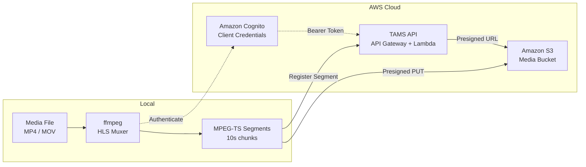

# TAMS Uploader

A command-line tool for uploading local media files (MP4, MOV) to a [Time-Addressable Media Store (TAMS)](https://github.com/awslabs/time-addressable-media-store) server. The tool segments media using ffmpeg, uploads each segment to S3 via presigned URLs, and registers them with the TAMS API.

### Why segment and upload?

Large media files (multi-GB camera rushes, live recordings) benefit from segmented upload because:

- **Fast playback** — segments become available for preview within seconds of upload starting, without waiting for the entire file to transfer
- **Early clipping and inference** — downstream workflows (AI analysis, editorial clipping) can begin processing segments as they arrive
- **Reliable transfer** — individual segment failures are retried independently with exponential backoff, avoiding full-file restart on network interruption
- **Progressive availability** — the TAMS timeline grows as segments are registered, giving operators visibility of upload progress in the player

### Segmentation notes

- **No transcoding** — the tool uses `ffmpeg -c copy` (stream copy mode). Video and audio codecs are muxed directly from the source container into MPEG-TS segments without re-encoding. This is fast and lossless but requires the source to contain HLS-compatible codecs (H.264 video, AAC audio). If transcoding is required (e.g. HEVC to H.264, or ProRes to H.264), the ffmpeg command in the script can be modified to include encoding parameters.
- **Timestamp continuity** — the tool uses ffmpeg's HLS muxer (`-f hls`) rather than the segment muxer (`-f segment`) to ensure presentation timestamps (PTS/DTS) remain continuous across segment boundaries. This prevents decode errors during sequential playback. Segment durations are determined by keyframe (IDR) positions in the source, so actual segment lengths may differ slightly from the requested duration (e.g. 11.4s instead of 10s for content with 2-second GOPs).

## Architecture



**Upload flow:**
1. Authenticate via Cognito client credentials grant
2. Create TAMS sources and flows (metadata registration)
3. For each segment: request presigned S3 URL → upload binary → register timerange

## Features

- Automatic media analysis (codec, resolution, frame rate, bitrate)
- HLS-compatible MPEG-TS segmentation with configurable segment duration
- Progress bar with upload speed and ETA
- Retry logic with exponential backoff (3 attempts per segment) for resilient uploads
- Creates combined multi-flow (video + audio) for unified playback
- Interactive and non-interactive (scripted) modes
- Immediate playback availability during upload (flow visible with "ingesting" status)

## Prerequisites

The following tools must be installed and available on your PATH:

| Tool | Version | Purpose |
|------|---------|---------|
| `ffmpeg` | 4.x+ | Media segmentation (HLS muxer) |
| `ffprobe` | 4.x+ | Media analysis |
| `aws` | 2.x | AWS CLI for CloudFormation queries and Cognito auth |
| `curl` | 7.x+ | HTTP requests to TAMS API and S3 |
| `python3` | 3.8+ | UUID generation and JSON parsing |

### AWS Requirements

- A deployed [TAMS API](https://github.com/awslabs/time-addressable-media-store) CloudFormation stack
- AWS credentials configured (via `~/.aws/credentials`, environment variables, or IAM role) with permissions to:
  - `cloudformation:DescribeStacks` on the TAMS API stack
  - `cognito-idp:DescribeUserPoolClient` on the TAMS Cognito User Pool
- The Cognito app client must have the `tams-api/read`, `tams-api/write`, and `tams-api/delete` scopes enabled

### Supported Input Formats

| Container | Video Codecs | Audio Codecs |
|-----------|-------------|--------------|
| MP4 (.mp4) | H.264 (AVC) | AAC |
| MOV (.mov) | H.264 (AVC) | AAC |

> **Note:** The tool uses stream copy (`-c copy`) — no re-encoding is performed. The source file must already contain H.264 video for MPEG-TS compatibility.

## Configuration

The tool reads configuration from environment variables with sensible defaults:

| Variable | Default | Description |
|----------|---------|-------------|
| `TAMS_REGION` | `ap-southeast-2` | AWS region where TAMS is deployed |
| `TAMS_STACK_NAME` | `tams-api` | CloudFormation stack name for the TAMS API |

## Usage

### Interactive mode

Run without arguments for guided input:

```bash
./tams-upload.sh
```

You will be prompted for:
1. Path to the media file
2. Label (defaults to filename)
3. Segment duration in seconds (defaults to 10)

### Command-line mode

```bash
./tams-upload.sh <path-to-mp4> [segment_duration] [label] [--yes]
```

**Arguments:**

| Argument | Required | Description |
|----------|----------|-------------|
| `path-to-mp4` | Yes | Path to the local MP4 file |
| `segment_duration` | No | Segment length in seconds (default: 10) |
| `label` | No | Descriptive label (default: filename without extension) |
| `--yes` / `-y` | No | Skip confirmation prompt (for automation) |

**Examples:**

```bash
# Upload with defaults (10s segments, filename as label)
./tams-upload.sh ~/Videos/interview.mp4

# Upload with 5-second segments and custom label
./tams-upload.sh ~/Videos/interview.mp4 5 "Customer Interview 2026"

# Fully automated (no confirmation prompt)
./tams-upload.sh ~/Videos/interview.mp4 10 "Automated Upload" --yes
```

### Using a different TAMS deployment

```bash
export TAMS_REGION=us-east-1
export TAMS_STACK_NAME=my-tams-stack
./tams-upload.sh ~/Videos/clip.mp4
```

## How it works

1. **Analyses** the MP4 file to detect video/audio tracks, codecs, resolution, and bitrate
2. **Segments** the file into MPEG-TS chunks using the HLS muxer (preserves timestamp continuity across segments)
3. **Authenticates** with the TAMS API via AWS Cognito client credentials grant
4. **Creates** TAMS sources and flows (video, audio, and combined multi-flow with `flow_status: "ingesting"`)
5. **Uploads** each segment to S3 via presigned URLs with retry on failure
6. **Registers** each segment's timerange with the TAMS API
7. **Marks** all flows as `ready` when complete

The multi-flow appears in the TAMS Tools portal immediately (with status "ingesting") so playback can begin while upload is still in progress.

### TAMS Entity Model

```
Source (video)  ──▶  Flow (H.264/mpegts)  ──▶  Segments [0:0_10:0), [10:0_20:0), ...
Source (audio)  ──▶  Flow (AAC/mpegts)    ──▶  Segments [0:0_10:0), [10:0_20:0), ...
Source (multi)  ──▶  Flow (collection)    ──▶  References video + audio flows
```

Each segment is registered with a timerange in the format `[start_seconds:nanoseconds_end_seconds:nanoseconds)` representing its position in the timeline.

## Playback

After upload completes (or during upload for live preview), view your content in the TAMS Tools web UI:

| Player | Route | Use Case |
|--------|-------|----------|
| Omakase Player | `/player/sources/<source-id>` | VOD playback of completed uploads |
| HLS Player | `/hlsplayer/flows/<video-flow-id>` | Live/growing playback during upload |

> **Note:** The Omakase Player does not auto-refresh — it takes a snapshot of available segments when the page loads. For growing playback during upload, use the HLS Player.

## Security Considerations

- **Credentials:** The tool uses the Cognito client credentials grant (machine-to-machine). Tokens are valid for 1 hour and are not persisted to disk.
- **Presigned URLs:** S3 upload URLs are short-lived and scoped to a single object. They are not logged or stored.
- **Network:** All communication with AWS services uses HTTPS/TLS.
- **Local files:** Temporary segment files are created in a system temp directory and cleaned up on completion or interruption (via trap handler).
- **No secrets in code:** Stack name and region are the only configuration values. All secrets (client ID, client secret, tokens) are fetched at runtime from AWS services.

## Limitations

- **Token expiry:** Cognito tokens expire after 1 hour. For very large files (700+ segments), the upload may exceed this window. Re-run the script if uploads begin failing.
- **Sequential uploads:** Segments are uploaded one at a time. For large files, this is network-bound at approximately 1-2 MB/s per segment depending on connection speed.
- **No resume:** If interrupted, the script must be re-run from the beginning (creates new source/flow IDs). Previously uploaded segments from interrupted runs remain as orphans.
- **Codec requirement:** Source video must be H.264 — the tool does not transcode. Use the TAMS Tools `ingest-ffmpeg` component for server-side transcoding.
- **Segment duration:** Actual segment boundaries align to keyframes, so segments may be slightly longer than the requested duration (e.g. 11.4s instead of 10s for content with 2-second GOPs).

## Troubleshooting

| Symptom | Cause | Fix |
|---------|-------|-----|
| Uploads fail after initial success | Cognito token expired (1 hour limit) | Re-run the script |
| Source not visible in portal | Browser cache | Hard refresh (Cmd+Shift+R) |
| `MEDIA_ERR_DECODE` in player | Incompatible segment format | Ensure you're using this script (HLS muxer), not raw `ffmpeg -f segment` |
| Audio/video out of sync | Segment duration mismatch | Use same segment duration for both tracks (this is the default) |
| "No available working or supported playlists" | Missing `BANDWIDTH` in HLS manifest | Use the HLS Player (`/hlsplayer/...`) instead of Omakase for this flow |
| Script fails at "Authenticating" | AWS credentials not configured or insufficient permissions | Run `aws sts get-caller-identity` to verify credentials |
| "Stack not found" error | Wrong stack name or region | Set `TAMS_STACK_NAME` and `TAMS_REGION` environment variables |

## Clean Up

To remove uploaded content from the TAMS store, use the TAMS API directly:

```bash
# Delete a flow (removes segment registrations)
curl -X DELETE "$API_ENDPOINT/flows/<flow-id>" -H "Authorization: Bearer $TOKEN"

# Delete a source
curl -X DELETE "$API_ENDPOINT/sources/<source-id>" -H "Authorization: Bearer $TOKEN"
```

> **Note:** Deleting flows removes segment metadata but does not delete the underlying S3 objects. S3 lifecycle policies on the media bucket handle object expiry.

## License

This tool is part of the [TAMS Tools](https://github.com/aws-samples/time-addressable-media-store-tools) project. See the repository root for license details.
