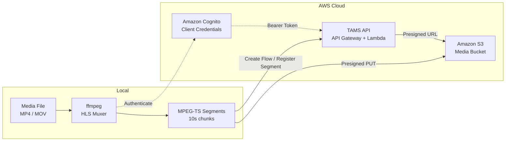

# TAMS Uploader

A command-line tool for uploading local media files (MP4, MOV) to a [Time-Addressable Media Store (TAMS)](https://github.com/awslabs/time-addressable-media-store) server. The tool segments media using ffmpeg, uploads each segment to S3 via presigned URLs, and registers them with the TAMS API.

> **⚠️ Reference code — not production software.** This tool is provided as a
> reference implementation to demonstrate the segmented-upload workflow against
> the TAMS API. Its requests have been validated against the official TAMS
> OpenAPI spec (v8.1) and exercised end-to-end against a live TAMS deployment
> (including Omakase playback of the result). However, it is intended as a
> starting point and example — not a hardened, supported product. Review,
> test, and adapt it for your own environment before relying on it; use at your
> own risk.

### Why segment and upload?

Large media files (multi-GB camera rushes, live recordings) benefit from segmented upload because:

- **Fast playback** — segments become available for preview within seconds of upload starting, without waiting for the entire file to transfer
- **Early clipping and inference** — downstream workflows (AI analysis, editorial clipping) can begin processing segments as they arrive
- **Reliable transfer** — individual segment failures are retried independently with exponential backoff, avoiding full-file restart on network interruption
- **Progressive availability** — the TAMS timeline grows as segments are registered, giving operators visibility of upload progress in the player

### Segmentation notes

- **No transcoding** — the tool uses `ffmpeg -c copy` (stream copy mode). Video and audio codecs are muxed directly from the source container into MPEG-TS segments without re-encoding. This is fast and lossless but requires the source to contain HLS-compatible codecs (H.264 video, AAC audio). If transcoding is required (e.g. HEVC to H.264, or ProRes to H.264), the ffmpeg command in the script can be modified to include encoding parameters.
- **Timestamp continuity** — the tool uses ffmpeg's HLS muxer (`-f hls`) rather than the segment muxer (`-f segment`) to ensure presentation timestamps (PTS/DTS) remain continuous across segment boundaries. This prevents decode errors during sequential playback. Segment durations are determined by keyframe (IDR) positions in the source, so actual segment lengths may differ slightly from the requested duration (e.g. 11.4s instead of 10s for content with 2-second GOPs).

## Architecture



**Upload flow:**
1. Authenticate via Cognito client credentials grant
2. Create TAMS flows (each flow auto-creates its source; source metadata is then set via sub-resources)
3. For each segment: request presigned S3 URL → upload binary → register timerange

## Features

- Automatic media analysis (codec, resolution, frame rate, bitrate)
- HLS-compatible MPEG-TS segmentation with configurable segment duration
- Progress bar with upload speed and ETA
- **Parallel segment uploads** (configurable concurrency) for faster transfer over field connections
- Retry logic with error classification and exponential backoff (3 attempts per segment) for resilient uploads
- **Automatic token refresh** so long uploads don't fail when the Cognito token expires mid-transfer
- **Restricted-network support** — works through corporate/public WiFi proxies and TLS-inspecting gateways (only needs outbound HTTPS)
- **Network preflight** check that fails fast (before segmenting) on a blocked connection or captive portal
- **Persistent run log** for post-mortem diagnosis of failed transfers
- Creates combined multi-flow (video + audio) for unified playback
- Interactive and non-interactive (scripted) modes
- Immediate playback availability during upload (flow visible with "ingesting" status)

## Supported Platforms

| Platform | Status | Notes |
|----------|--------|-------|
| **macOS** (Intel/Apple Silicon) | Fully supported | Primary development platform |
| **Linux** (Ubuntu, Amazon Linux, RHEL) | Fully supported | All dependencies available via package managers |
| **Windows + WSL2** | Supported | Run inside WSL2 with Ubuntu; native Windows (cmd/PowerShell) is not supported |
| **Windows** (native) | Not supported | Bash script requires a Unix shell environment |

> **Note:** The script requires a POSIX-compatible shell (bash 3.2+) and a terminal that supports ANSI escape codes and UTF-8 for the progress bar and spinner display.

## Prerequisites

The following tools must be installed and available on your PATH:

| Tool | Version | Purpose | Install |
|------|---------|---------|---------|
| `bash` | 3.2+ | Shell runtime | Pre-installed on macOS/Linux |
| `ffmpeg` | 4.x+ | Media segmentation (HLS muxer) | `brew install ffmpeg` / `apt install ffmpeg` |
| `ffprobe` | 4.x+ | Media analysis | Included with ffmpeg |
| `aws` | 2.x | AWS CLI for CloudFormation queries and Cognito auth | [Install guide](https://docs.aws.amazon.com/cli/latest/userguide/getting-started-install.html) |
| `curl` | 7.x+ | HTTP requests to TAMS API and S3 | Pre-installed on macOS/Linux |
| `python3` | 3.8+ | UUID generation and JSON parsing | Pre-installed on macOS/Linux |

### AWS Requirements

- A deployed [TAMS API](https://github.com/awslabs/time-addressable-media-store) CloudFormation stack
- AWS credentials configured (via `~/.aws/credentials`, environment variables, or IAM role) with permissions to:
  - `cloudformation:DescribeStacks` on the TAMS API stack
  - `cognito-idp:DescribeUserPoolClient` on the TAMS Cognito User Pool
- The Cognito app client must have the `tams-api/read`, `tams-api/write`, and `tams-api/delete` scopes enabled

### Supported Input Formats

| Container | Video Codecs | Audio Codecs |
|-----------|-------------|--------------|
| MP4 (.mp4) | H.264 (AVC) | AAC |
| MOV (.mov) | H.264 (AVC) | AAC |

> **Note:** The tool uses stream copy (`-c copy`) — no re-encoding is performed. The source file must already contain H.264 video for MPEG-TS compatibility.

## Configuration

### Automatic discovery via CloudFormation

The tool requires a deployed [TAMS API](https://github.com/awslabs/time-addressable-media-store) stack as a dependency. At runtime, it automatically discovers all connection parameters by querying the stack's CloudFormation outputs — no manual endpoint configuration is needed.

The following values are retrieved automatically from the TAMS API stack outputs:

| CloudFormation Output | Used For |
|-----------------------|----------|
| `ApiEndpoint` | TAMS API base URL for all REST calls |
| `UserPoolId` | Cognito User Pool for client secret lookup |
| `UserPoolClientId` | Cognito app client ID for authentication |
| `TokenUrl` | Cognito token endpoint for client credentials grant |

The tool then fetches the `ClientSecret` from Cognito using `describe-user-pool-client` and exchanges it for a short-lived Bearer token. This means the only configuration required from the operator is the stack name and region:

| Variable | Default | Description |
|----------|---------|-------------|
| `TAMS_REGION` | `ap-southeast-2` | AWS region where the TAMS API stack is deployed |
| `TAMS_STACK_NAME` | `tams-api` | CloudFormation stack name used when deploying the [TAMS API](https://github.com/awslabs/time-addressable-media-store) |

> **Dependency:** The TAMS API must be deployed before using this tool. Follow the deployment instructions at https://github.com/awslabs/time-addressable-media-store to set up the API stack.

## Usage

### Interactive mode

Run without arguments for guided input:

```bash
./tams-upload.sh
```

You will be prompted for:
1. Path to the media file
2. Label (defaults to filename)
3. Segment duration in seconds (defaults to 10)

### Command-line mode

```bash
./tams-upload.sh [options] <path-to-mp4> [segment_duration] [label]
```

**Arguments:**

| Argument | Required | Description |
|----------|----------|-------------|
| `path-to-mp4` | Yes | Path to the local MP4 file |
| `segment_duration` | No | Segment length in seconds (default: 10) |
| `label` | No | Descriptive label (default: filename without extension) |
| `--yes` / `-y` | No | Skip confirmation prompt (for automation) |
| `--proxy <url>` | No | HTTP/HTTPS proxy for corporate/guest WiFi (e.g. `http://proxy.corp:8080`) |
| `--ca-bundle <file>` | No | CA certificate bundle for networks that inspect HTTPS traffic |
| `--help` / `-h` | No | Show usage and exit |

**Examples:**

```bash
# Upload with defaults (10s segments, filename as label)
./tams-upload.sh ~/Videos/interview.mp4

# Upload with 5-second segments and custom label
./tams-upload.sh ~/Videos/interview.mp4 5 "Customer Interview 2026"

# Fully automated (no confirmation prompt)
./tams-upload.sh ~/Videos/interview.mp4 10 "Automated Upload" --yes
```

### Using a different TAMS deployment

```bash
export TAMS_REGION=us-east-1
export TAMS_STACK_NAME=my-tams-stack
./tams-upload.sh ~/Videos/clip.mp4
```

## Network Requirements

This tool is designed to run from a laptop in the field on whatever internet
connection is available (corporate guest WiFi, hotel/cafe WiFi, mobile
hotspot). Its network footprint is deliberately minimal.

### Ports

**The tool only needs outbound TCP 443 (HTTPS) and DNS — the same as a web
browser.** It uses no non-standard ports. If a network allows normal web
browsing, it will allow this tool. You do **not** need a special firewall
exception beyond standard HTTPS egress.

| Destination | Port | Purpose |
|-------------|------|---------|
| `cloudformation.<region>.amazonaws.com` | TCP 443 | Discover stack outputs |
| `cognito-idp.<region>.amazonaws.com` + Cognito token endpoint | TCP 443 | Authentication |
| API Gateway (TAMS API endpoint) | TCP 443 | Register sources/flows/segments |
| Amazon S3 | TCP 443 | Upload segment bytes (presigned PUT) |
| DNS resolver | UDP/TCP 53 | Name resolution for all of the above |

> If your TAMS API is deployed behind a custom domain on a non-standard port
> (e.g. an ALB on `:8443`), that port must also be open. On a connection
> failure the tool logs the exact `host:port` it could not reach.

### Corporate proxies

If your network forces an HTTP proxy, pass it explicitly. The tool wires the
proxy into **both** `curl` (uploads/API) and the `aws` CLI (discovery/auth),
which otherwise honour different environment-variable conventions:

```bash
./tams-upload.sh --proxy http://proxy.corp:8080 ~/Videos/clip.mp4
# or via environment:
export TAMS_PROXY=http://proxy.corp:8080
```

### TLS-inspecting networks

Many corporate networks re-sign HTTPS traffic with a private CA. If you see a
certificate-verification error, obtain your organisation's CA certificate from
IT and pass it:

```bash
./tams-upload.sh --ca-bundle /path/to/corp-ca.pem ~/Videos/clip.mp4
# or via environment:
export TAMS_CA_BUNDLE=/path/to/corp-ca.pem
```

> The tool never disables certificate verification — doing so would expose your
> AWS credentials to interception. Always use a proper CA bundle instead.

### Captive portals

On public WiFi (hotels, cafes, airports), complete the browser-based WiFi login
*before* running the tool. The preflight check detects an unfinished captive
portal and tells you to log in rather than failing cryptically partway through.

### Tuning

| Variable | Default | Description |
|----------|---------|-------------|
| `TAMS_PARALLEL` | `4` | Concurrent segment uploads. Lower it (e.g. `1`) on a very weak uplink to avoid congestion; raise it on fast links for more throughput. |
| `TAMS_CONNECT_TIMEOUT` | `10` | Per-request connection timeout (seconds). |
| `TAMS_MAX_TIME` | `300` | Total timeout (seconds) for the small JSON API calls. |
| `TAMS_UPLOAD_MAX_TIME` | `1800` | Total timeout (seconds) for a single segment's S3 upload. Raise for very large segments on slow links. |
| `TAMS_LOG_FILE` | `$TMPDIR/tams-upload-<epoch>.log` | Path to the persistent run log. |

## How it works

1. **Checks** network connectivity to AWS (preflight) before doing expensive work, so a blocked link or captive portal fails in seconds
2. **Analyses** the MP4 file to detect video/audio tracks, codecs, resolution, and bitrate
3. **Segments** the file into MPEG-TS chunks using the HLS muxer (preserves timestamp continuity across segments)
4. **Authenticates** with the TAMS API via AWS Cognito client credentials grant
5. **Creates** TAMS flows (video, audio, and combined multi-flow with `flow_status: "ingesting"`). Each flow references a `source_id`; the TAMS API **auto-creates the source** from the flow, after which the source's `label`, `description`, and `tags` are set via its sub-resources.
6. **Uploads** segments to S3 via presigned URLs, several in parallel, with classified retries and automatic token refresh
7. **Registers** each segment's timerange with the TAMS API
8. **Marks** a flow as `ready` only if all of its segments uploaded successfully; flows with failed segments are left `ingesting` and the failures are reported

The multi-flow appears in the TAMS Tools portal immediately (with status "ingesting") so playback can begin while upload is still in progress.

### TAMS Entity Model

In TAMS, a **source** is a logical, format-agnostic identifier for a piece of
content; a **flow** is a concrete rendition of that source (a specific codec,
container, resolution). Sources are **derived from flows** — you create a flow
referencing a `source_id` and the source is materialised automatically. The
API does not accept a whole-object `PUT /sources/{id}`; source metadata is set
through sub-resources (`/sources/{id}/label`, `/description`, `/tags/{name}`).

```
Flow (H.264/mpegts)  ──▶  auto-creates  ──▶  Source (video)   Segments [0:0_10:0), [10:0_20:0), ...
Flow (AAC/mpegts)    ──▶  auto-creates  ──▶  Source (audio)   Segments [0:0_10:0), [10:0_20:0), ...
Flow (collection)    ──▶  auto-creates  ──▶  Source (multi)   References video + audio flows
```

Each segment is registered with a timerange in the format `[start_seconds:nanoseconds_end_seconds:nanoseconds)` representing its position in the timeline.

> **Note on `flow_status`:** The tool tags flows with `flow_status: "ingesting"` during upload and `"ready"` on completion. This is a **tams-uploader convention**, not a standard TAMS field — the TAMS spec represents flow immutability via the dedicated `read_only` boolean, not a status tag. The tag is schema-valid (TAMS `tags` is a freeform string map) and is used here so the portal can show ingest progress, but other TAMS clients won't interpret it. The tool deliberately does **not** set `read_only`, so flows remain appendable after upload.

## Playback

After upload completes (or during upload for live preview), view your content in the TAMS Tools web UI:

| Player | Route | Use Case |
|--------|-------|----------|
| Omakase Player | `/player/sources/<source-id>` | VOD playback of completed uploads |
| HLS Player | `/hlsplayer/flows/<video-flow-id>` | Live/growing playback during upload |

> **Note:** The Omakase Player does not auto-refresh — it takes a snapshot of available segments when the page loads. For growing playback during upload, use the HLS Player.

## Security Considerations

- **Credentials:** The tool uses the Cognito client credentials grant (machine-to-machine). Tokens are valid for 1 hour, refreshed automatically before expiry during long uploads, and are not persisted to disk.
- **Presigned URLs:** S3 upload URLs are short-lived and scoped to a single object. They are not logged or stored.
- **Network:** All communication with AWS services uses HTTPS/TLS.
- **Local files:** Temporary segment files are created in a system temp directory and cleaned up on completion or interruption (via trap handler).
- **No secrets in code:** Stack name and region are the only configuration values. All secrets (client ID, client secret, tokens) are fetched at runtime from AWS services.

## Limitations

- **No resume:** If interrupted, the script must be re-run from the beginning (creates new source/flow IDs). Previously uploaded segments from interrupted runs remain as orphans.
- **Orphaned objects on partial failure:** If a segment's S3 upload succeeds but its registration fails, a retry uploads a fresh object, leaving the first orphaned in S3 (cleaned up by the bucket's lifecycle policy).
- **Codec requirement:** Source video must be H.264 — the tool does not transcode. Use the TAMS Tools `ingest-ffmpeg` component for server-side transcoding.
- **Segment duration:** Actual segment boundaries align to keyframes, so segments may be slightly longer than the requested duration (e.g. 11.4s instead of 10s for content with 2-second GOPs).

## Troubleshooting

| Symptom | Cause | Fix |
|---------|-------|-----|
| `Cannot reach ... on port 443` at preflight | Network blocks egress, or a proxy is required | Pass `--proxy http://host:port` (or set `HTTPS_PROXY`); check the log for the exact `host:port` |
| `HTTPS appears to be intercepted` / TLS errors | TLS-inspecting corporate gateway | Get the corporate CA cert from IT and pass `--ca-bundle <file>` |
| `Unexpected 200` / `captive portal` warning | Public WiFi login not completed | Open a browser, finish the WiFi login, then re-run |
| `AWS rejected the request due to clock skew` | Laptop clock drifted (common after travel/sleep) | Enable automatic network time, then re-run |
| Some segments failed; flow left `ingesting` | Transient network failures exhausted retries | Check the run log (path printed at startup) for per-segment errors; re-run to retry |
| Source not visible in portal | Browser cache | Hard refresh (Cmd+Shift+R) |
| `MEDIA_ERR_DECODE` in player | Incompatible segment format | Ensure you're using this script (HLS muxer), not raw `ffmpeg -f segment` |
| Audio/video out of sync | Segment duration mismatch | Use same segment duration for both tracks (this is the default) |
| "No available working or supported playlists" | Missing `BANDWIDTH` in HLS manifest | Use the HLS Player (`/hlsplayer/...`) instead of Omakase for this flow |
| Script fails at "Authenticating" | AWS credentials not configured or insufficient permissions | Run `aws sts get-caller-identity` to verify credentials |
| "Stack not found" error | Wrong stack name or region | Set `TAMS_STACK_NAME` and `TAMS_REGION` environment variables |

## Clean Up

To remove uploaded content from the TAMS store, use the TAMS API directly:

```bash
# Delete a flow (removes segment registrations)
curl -X DELETE "$API_ENDPOINT/flows/<flow-id>" -H "Authorization: Bearer $TOKEN"

# Delete a source
curl -X DELETE "$API_ENDPOINT/sources/<source-id>" -H "Authorization: Bearer $TOKEN"
```

> **Note:** Deleting flows removes segment metadata but does not delete the underlying S3 objects. S3 lifecycle policies on the media bucket handle object expiry.

## License

This tool is part of the [TAMS Tools](https://github.com/aws-samples/time-addressable-media-store-tools) project. See the repository root for license details.

## Release Notes

### v2.1 — 2026-05-30

Focus: reliable and observable transfers from the field over restricted/shared networks.

**Reliability**
- Parallel segment uploads (configurable via `TAMS_PARALLEL`, default 4) for faster transfer; sequential behaviour available with `TAMS_PARALLEL=1`.
- Automatic Cognito token refresh before expiry, so long uploads no longer fail partway through (previously required a manual re-run after ~1 hour).
- Per-request connection/total timeouts (`TAMS_CONNECT_TIMEOUT`, `TAMS_MAX_TIME`) so stalled connections fail fast into the retry path instead of hanging.
- Retry logic now classifies errors: transient errors (5xx/429/network) back off and retry, `401` triggers re-authentication, and other `4xx` fail fast instead of burning all retries.
- A flow is marked `ready` only when **all** its segments uploaded; flows with failed segments are left `ingesting` and the failures are reported, rather than being silently marked complete.
- Source/flow registration calls now share the same hardened HTTP path (timeouts, proxy/CA, status checks) instead of silently discarding errors.

**Restricted-network support**
- Network preflight check runs **before** segmentation, failing in seconds on a blocked connection rather than after minutes of ffmpeg work.
- `--proxy` flag (and `TAMS_PROXY`) wires an HTTP proxy into both `curl` and the `aws` CLI.
- `--ca-bundle` flag (and `TAMS_CA_BUNDLE`) supports TLS-inspecting corporate gateways without ever disabling certificate verification.
- Detection and actionable guidance for captive portals, TLS interception, and laptop clock skew.
- Documented that the tool needs only outbound TCP 443 + DNS.

**Observability**
- Persistent timestamped run log (path printed at startup; override with `TAMS_LOG_FILE`) capturing per-segment outcomes, HTTP statuses, and server error bodies.
- Failed `host:port` is logged on connection errors to make blocked non-standard ports obvious.
- Completion report shows uploaded/total counts per track and surfaces failed-segment counts.

**Correctness**
- Flow-first registration: create flows (which auto-create their sources) and set source metadata via sub-resources, instead of `PUT /sources/{id}` — which the TAMS API rejects with a 403 (there is no `PUT` method on `/sources/{sourceId}` in the spec). Validated end-to-end against a live deployment with Omakase playback.
- Validated all request bodies and response-path reads against the official TAMS OpenAPI spec (v8.1) and the upstream Lambda handlers: flow objects, `POST /storage` (`limit`), and `POST /segments` (`object_id` + `timerange`) are fully conformant. `flow_status` is documented as a tool-local tag convention (the spec uses `read_only` for lifecycle).
- Captive-portal preflight now keys on `Content-Type: text/html` rather than HTTP status, fixing a false positive against AWS endpoints that return `200` health checks (e.g. CloudFormation) or non-2xx by design (Cognito, S3).

**Robustness & maintainability**
- Flow creation failures now abort with a clear message instead of cascading into confusing per-segment errors; finalisation failures warn without aborting.
- ffmpeg segmentation failures and zero-segment outputs (unsupported/corrupt input) now produce an actionable error instead of a cryptic crash; ffmpeg stderr is captured to the log.
- A missing video stream is detected up front with guidance toward server-side transcoding.
- Separate, larger timeout (`TAMS_UPLOAD_MAX_TIME`, default 1800s) for segment uploads so large segments on slow links aren't killed and re-sent.
- Flow JSON payloads are generated by single-source builders (no duplicated ingesting/ready blocks), and segmentation is factored into one helper shared by the video and audio tracks.
- Passes `shellcheck` cleanly; remains compatible with bash 3.2 (macOS default).

### v2.0

- Initial CLI tool: HLS segmentation, presigned S3 upload, TAMS source/flow registration, progress bar, interactive and non-interactive modes, progressive playback during upload.
